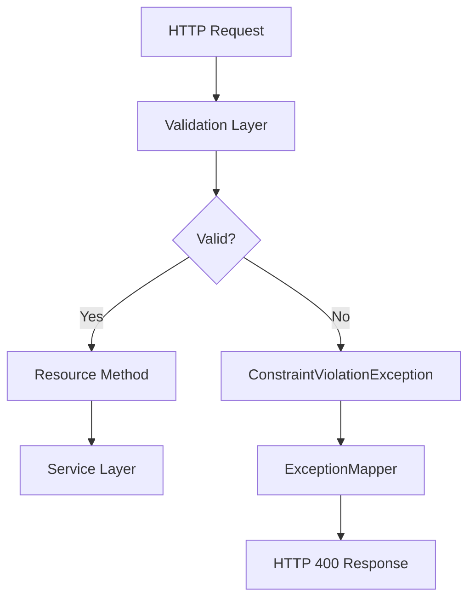

# Bean Validation in REST APIs (Jakarta Validation)

## Overview

This lesson introduces **Bean Validation (Jakarta Validation)** and its role in validating input automatically in REST APIs.

It focuses on:

- declarative validation  
- reducing boilerplate code  
- consistent and centralized validation  

---

## Core Concept — Bean Validation

### Definition

Bean Validation allows you to define validation rules **directly on fields or parameters** using annotations.

Example:

```java
@NotNull
@Size(min = 3)
private String name;
```

This means:

- `name` must not be `null`
- `name` must have at least 3 characters

-> You define *what is valid*, not *how to check it*

---

## Problem with Manual Validation

Typical manual validation:

```java
if (module != null && module.isBlank()) {
    throw new BadRequestException("Query parameter 'module' must not be blank");
}
```

### Issues

- repetitive  
- scattered across the codebase  
- harder to maintain  
- easy to forget  

---

## Goal of Bean Validation

```text
Define validation once -> apply automatically
```

- rules are declared once  
- framework executes them  
- invalid input is rejected early  

---

## Common Annotations

| Annotation | Meaning |
|-----------|--------|
| `@NotNull` | must not be null |
| `@NotBlank` | must not be empty or whitespace |
| `@Size(min, max)` | length constraint |
| `@Min`, `@Max` | numeric limits |
| `@Pattern` | regex validation |
| `@Valid` | validate nested objects / DTOs |

---

## Where Validation Happens

Validation is executed **before your resource method runs**.



-> Invalid input never reaches your business logic

---

## Enable Validation (Quarkus)

Add the required extension:

```text
quarkus-hibernate-validator
```

---

## Validate a Query Parameter

```java
@GET
public List<CardDto> getCards(
    @QueryParam("module") @NotBlank String module
) {
    return cardService.getByModule(module);
}
```

### Behavior

Request:

```text
GET /api/cards?module=
```

Response (example):

```json
{
  "message": "module must not be blank",
  "status": 400,
  "timestamp": "..."
}
```

---

## Important Concept

```text
Validation happens BEFORE your method is executed
```

- invalid input is blocked early  
- no manual checks required in most cases  

---

## @NotNull vs @NotBlank (Important)

| Annotation | Allows null | Allows "" | Allows "   " |
|-----------|------------|-----------|--------------|
| `@NotNull` | No | Yes | Yes |
| `@NotBlank` | No | No | No |

-> For Strings, `@NotBlank` is usually the better choice

---

## Exception Handling

Validation failures typically throw:

```text
ConstraintViolationException
```

You should map this to:

```text
400 Bad Request
```

---

## Example Exception Mapper

```java
@Provider
public class ConstraintViolationExceptionMapper
        implements ExceptionMapper<ConstraintViolationException> {

    @Override
    public Response toResponse(ConstraintViolationException exception) {
        return Response.status(Response.Status.BAD_REQUEST)
                .entity(new ErrorResponseDto("Validation failed", 400))
                .build();
    }
}
```

-> Centralized error handling  
-> Consistent API responses  

---

## Declarative vs Imperative Validation

| Approach | Style |
|--------|------|
| Manual validation | imperative (`if/else`) |
| Bean Validation | declarative (annotations) |

### Meaning

- imperative: describe *how* to validate  
- declarative: describe *what must be true*  

-> Declarative code is cleaner and easier to maintain

---

## Combining with Existing Validation

Use both approaches where appropriate:

| Validation Type | Approach |
|-----------------|---------|
| parameter existence / format | Bean Validation |
| allowed query parameters | custom validator |
| complex business rules | service layer |

Example:

```java
queryParamValidator.validateAllowedParams(...);

@QueryParam("module") @NotBlank String module
```

---

## DTO Validation with @Valid

```java
public class CardCreateDto {

    @NotBlank
    private String question;

    @NotBlank
    private String answer;

    @NotBlank
    private String module;
}
```

Usage:

```java
@POST
public Response createCard(@Valid CardCreateDto dto) {
    return Response.ok(cardService.create(dto)).build();
}
```

-> Entire object is validated automatically  
-> Keeps validation close to the data model  

---

## Practical Comparison

### Without Bean Validation

```java
@GET
public List<CardDto> getCards(@QueryParam("module") String module) {
    if (module != null && module.isBlank()) {
        throw new BadRequestException("Query parameter 'module' must not be blank");
    }

    return cardService.getByModule(module);
}
```

### With Bean Validation

```java
@GET
public List<CardDto> getCards(
    @QueryParam("module") @NotBlank String module
) {
    return cardService.getByModule(module);
}
```

---

## Why This Is Better

| Without Bean Validation | With Bean Validation |
|------------------------|---------------------|
| manual checks everywhere | centralized rules |
| duplicated logic | reusable annotations |
| harder to scale | cleaner and consistent |
| easy to miss validations | automatic execution |

---

## Common Mistakes

### 1. Duplicating validation logic

Avoid:

- annotation + manual check for the same rule

---

### 2. Using wrong annotations

Example:

- using `@NotNull` instead of `@NotBlank` for Strings

---

### 3. Ignoring validation errors

Always map validation errors properly to HTTP responses.

---

### 4. Mixing validation with business logic

- Bean Validation -> input correctness  
- Service layer -> business rules  

---

## Exam Relevance

You should understand:

- what `@NotNull` and `@NotBlank` do  
- when validation is triggered  
- what `ConstraintViolationException` is  
- why HTTP 400 is returned  
- how `@Valid` works  

---

## Core Insight

```text
Validation should be declarative, consistent, and automatic.
```

---

## Summary

Bean Validation (Jakarta Validation) improves REST API design by:

- removing manual validation code  
- enforcing rules consistently  
- executing validation automatically  
- improving maintainability  

-> It is a standard and essential practice in modern Java backend development.