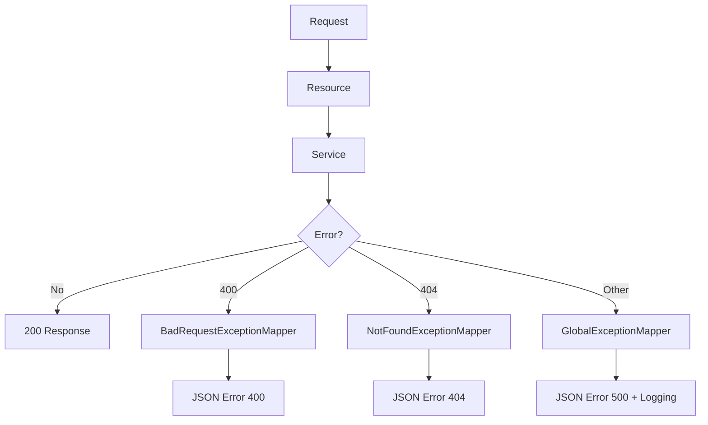

# Global Error Handling & Logging in REST APIs

## Lesson Overview

This lesson documents how **global error handling and logging** are implemented in a REST API and why both are required for a stable backend.

It builds directly on previous validation concepts and focuses on making the API:

- consistent  
- predictable  
- safe  
- debuggable  

---

## Core Concept — Global Error Handling

### Definition

Global error handling ensures that:

- all exceptions are handled centrally  
- all error responses follow a consistent format  
- unexpected failures do not break the API contract  

---

## Problem Without Global Handling

Without centralized handling:

- different endpoints return different error formats  
- framework may return HTML instead of JSON  
- internal exceptions may be exposed  
- debugging becomes inconsistent  

---

## Correct Behavior

All errors should return:

```json
{
  "message": "Error description",
  "status": 400,
  "timestamp": "ISO-8601"
}
```

---

## Error Categories

| Type | Meaning | Status |
|------|--------|--------|
| Bad Request | Invalid input from client | 400 |
| Not Found | Resource does not exist | 404 |
| Internal Error | Unexpected server failure | 500 |

---

## Architecture



---

## Global Exception Handling

### Principle

```text
Service throws exception -> ExceptionMapper converts to HTTP response
```

---

### Specific Exception Mappers

#### BadRequestExceptionMapper

- handles invalid input  
- returns **400**  
- message can be specific  

#### NotFoundExceptionMapper

- handles missing resources  
- returns **404**  
- message can be specific  

---

### GlobalExceptionMapper (Fallback)

Handles all unexpected errors:

- RuntimeException  
- NullPointerException  
- JSON parsing errors  
- system failures  

---

## Critical Rule

```text
400 / 404 -> detailed message
500       -> generic message
```

---

### Example

❌ Wrong:
```text
"NullPointerException at line 42"
```

✔ Correct:
```text
"An unexpected error occurred"
```

---

## Core Concept — Logging

### Definition

Logging ensures that internal errors are **visible to developers**, even when hidden from the client.

---

## Why Logging Is Required

Without logging:

- errors disappear silently  
- debugging becomes difficult  
- root causes are lost  

---

## Separation of Responsibilities

| Concern | Behavior |
|--------|----------|
| API Response | safe, generic |
| Logs | detailed, technical |

---

## Implementation — GlobalExceptionMapper

```java
@Provider
public class GlobalExceptionMapper implements ExceptionMapper<Throwable> {

    private static final Logger LOG = Logger.getLogger(GlobalExceptionMapper.class);

    @Override
    public Response toResponse(Throwable exception) {

        // log full error internally
        LOG.error("Unexpected error occurred", exception);

        // return safe response to client
        ErrorResponseDto error = new ErrorResponseDto(
            "An unexpected error occurred",
            500
        );

        return Response.status(Response.Status.INTERNAL_SERVER_ERROR)
            .entity(error)
            .type(MediaType.APPLICATION_JSON)
            .build();
    }
}
```

---

## Explanation

- `ExceptionMapper<Throwable>` catches all unhandled exceptions  
- `@Provider` registers the mapper  
- logging captures full exception details  
- response remains safe and consistent  

---

## Key Concept — Separation of Concerns

```text
Resource  -> HTTP handling
Service   -> business logic
Mapper    -> error translation
Logger    -> internal diagnostics
```

---

## Why This Approach Is Better

Before:

- inconsistent errors  
- internal details exposed  
- no centralized handling  

After:

- consistent error format  
- safe API responses  
- full internal visibility  
- scalable structure  

---

## Test Strategy

### 1. Success

```text
GET /api/cards
-> 200
```

---

### 2. Invalid Query Parameter

```text
GET /api/cards?foo=bar
-> 400
```

---

### 3. Not Found

```text
GET /api/cards/invalid-id
-> 404
```

---

### 4. Internal Error (test)

```java
throw new RuntimeException("TEST ERROR");
```

Response:

```json
{
  "message": "An unexpected error occurred",
  "status": 500,
  "timestamp": "..."
}
```

Logs:

```text
ERROR Unexpected error occurred
java.lang.RuntimeException: TEST ERROR
```

---

## What to Avoid

- exposing `exception.getMessage()` in 500 responses  
- handling errors inside resource classes  
- inconsistent error structures  
- missing logging  

---

## Key Insight

```text
An API must be predictable even when it fails.
```

---

## Exam Relevance

Relevant concepts:

- HTTP status codes (400, 404, 500)  
- exception handling in REST APIs  
- separation of concerns  
- secure error handling  
- logging vs response design  

You should be able to explain:

- why 500 errors must be generic  
- why logging is necessary  
- how ExceptionMapper works  

---

## Next Step

Extend error handling with:

```text
- validation frameworks (Bean Validation)
- custom exception types
- structured logging
- integration tests
```

---

## Core Insight

Global error handling and logging ensure that a backend is:

- stable  
- secure  
- maintainable  
- production-ready  

-> This is a fundamental pattern in real-world backend systems.---
title: "Global Error Handling & Logging in REST APIs"
project: "FIAE Exam Part 1 Backend"
author: "Sean"
date: 2026-04-17
type: "lesson"
tags:
  - backend
  - rest
  - exception-handling
  - logging
  - api-design
status: "in-progress"
---

# Global Error Handling & Logging in REST APIs

## Lesson Overview

This lesson documents how **global error handling and logging** are implemented in a REST API and why both are required for a stable backend.

It builds directly on previous validation concepts and focuses on making the API:

- consistent  
- predictable  
- safe  
- debuggable  

---

## Core Concept — Global Error Handling

### Definition

Global error handling ensures that:

- all exceptions are handled centrally  
- all error responses follow a consistent format  
- unexpected failures do not break the API contract  

---

## Problem Without Global Handling

Without centralized handling:

- different endpoints return different error formats  
- framework may return HTML instead of JSON  
- internal exceptions may be exposed  
- debugging becomes inconsistent  

---

## Correct Behavior

All errors should return:

```json
{
  "message": "Error description",
  "status": 400,
  "timestamp": "ISO-8601"
}
```

---

## Error Categories

| Type | Meaning | Status |
|------|--------|--------|
| Bad Request | Invalid input from client | 400 |
| Not Found | Resource does not exist | 404 |
| Internal Error | Unexpected server failure | 500 |

---

## Architecture


---

## Global Exception Handling

### Principle

```text
Service throws exception -> ExceptionMapper converts to HTTP response
```

---

### Specific Exception Mappers

#### BadRequestExceptionMapper

- handles invalid input  
- returns **400**  
- message can be specific  

#### NotFoundExceptionMapper

- handles missing resources  
- returns **404**  
- message can be specific  

---

### GlobalExceptionMapper (Fallback)

Handles all unexpected errors:

- RuntimeException  
- NullPointerException  
- JSON parsing errors  
- system failures  

---

## Critical Rule

```text
400 / 404 -> detailed message
500       -> generic message
```

---

### Example

❌ Wrong:
```text
"NullPointerException at line 42"
```

✔ Correct:
```text
"An unexpected error occurred"
```

---

## Core Concept — Logging

### Definition

Logging ensures that internal errors are **visible to developers**, even when hidden from the client.

---

## Why Logging Is Required

Without logging:

- errors disappear silently  
- debugging becomes difficult  
- root causes are lost  

---

## Separation of Responsibilities

| Concern | Behavior |
|--------|----------|
| API Response | safe, generic |
| Logs | detailed, technical |

---

## Implementation — GlobalExceptionMapper

```java
@Provider
public class GlobalExceptionMapper implements ExceptionMapper<Throwable> {

    private static final Logger LOG = Logger.getLogger(GlobalExceptionMapper.class);

    @Override
    public Response toResponse(Throwable exception) {

        // log full error internally
        LOG.error("Unexpected error occurred", exception);

        // return safe response to client
        ErrorResponseDto error = new ErrorResponseDto(
            "An unexpected error occurred",
            500
        );

        return Response.status(Response.Status.INTERNAL_SERVER_ERROR)
            .entity(error)
            .type(MediaType.APPLICATION_JSON)
            .build();
    }
}
```

---

## Explanation

- `ExceptionMapper<Throwable>` catches all unhandled exceptions  
- `@Provider` registers the mapper  
- logging captures full exception details  
- response remains safe and consistent  

---

## Key Concept — Separation of Concerns

```text
Resource  -> HTTP handling
Service   -> business logic
Mapper    -> error translation
Logger    -> internal diagnostics
```

---

## Why This Approach Is Better

Before:

- inconsistent errors  
- internal details exposed  
- no centralized handling  

After:

- consistent error format  
- safe API responses  
- full internal visibility  
- scalable structure  

---

## Test Strategy

### 1. Success

```text
GET /api/cards
-> 200
```

---

### 2. Invalid Query Parameter

```text
GET /api/cards?foo=bar
-> 400
```

---

### 3. Not Found

```text
GET /api/cards/invalid-id
-> 404
```

---

### 4. Internal Error (test)

```java
throw new RuntimeException("TEST ERROR");
```

Response:

```json
{
  "message": "An unexpected error occurred",
  "status": 500,
  "timestamp": "..."
}
```

Logs:

```text
ERROR Unexpected error occurred
java.lang.RuntimeException: TEST ERROR
```

---

## What to Avoid

- exposing `exception.getMessage()` in 500 responses  
- handling errors inside resource classes  
- inconsistent error structures  
- missing logging  

---

## Key Insight

```text
An API must be predictable even when it fails.
```

---

## Exam Relevance

Relevant concepts:

- HTTP status codes (400, 404, 500)  
- exception handling in REST APIs  
- separation of concerns  
- secure error handling  
- logging vs response design  

You should be able to explain:

- why 500 errors must be generic  
- why logging is necessary  
- how ExceptionMapper works  

---

## Next Step

Extend error handling with:

```text
- validation frameworks (Bean Validation)
- custom exception types
- structured logging
- integration tests
```

---

## Core Insight

Global error handling and logging ensure that a backend is:

- stable  
- secure  
- maintainable  
- production-ready  

-> This is a fundamental pattern in real-world backend systems.