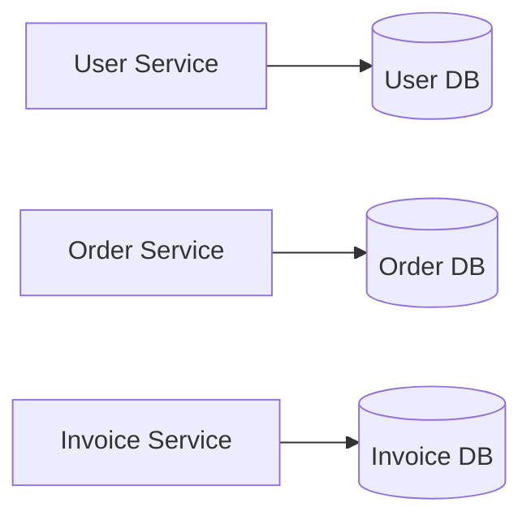

# UUID/GUID and Unique Identifiers

## Overview

A **UUID** or **GUID** is a standardized identifier format used to create values that are extremely unlikely to collide.

In backend development, UUIDs are often used as identifiers for resources in REST APIs, databases, distributed systems, and public URLs.

Example UUID:

```text
550e8400-e29b-41d4-a716-446655440000
```

For an aspiring backend developer, the key question is not only:

> “What is a UUID?”

but also:

> “When should I use UUIDs instead of auto-incrementing database IDs?”

---

## Core Definition

### UUID

**UUID** stands for **Universally Unique Identifier**.

A UUID is a **128-bit identifier** usually written as 32 hexadecimal characters separated by hyphens.

Standard format:

```text
xxxxxxxx-xxxx-xxxx-xxxx-xxxxxxxxxxxx
```

Example:

```text
550e8400-e29b-41d4-a716-446655440000
```

### GUID

**GUID** stands for **Globally Unique Identifier**.

In most backend development contexts, **UUID** and **GUID** mean almost the same thing.

| Term | Common usage |
|---|---|
| UUID | General standard term |
| GUID | Often used in Microsoft ecosystems |

Simple memory rule:

> **UUID and GUID are globally unique IDs.**

---

## Why Unique Identifiers Matter

Backend applications constantly need identifiers for things like:

- users
- orders
- products
- invoices
- sessions
- files
- database records
- API resources

Example REST resource:

```http
GET /api/users/550e8400-e29b-41d4-a716-446655440000
```

The identifier tells the backend which resource the client wants.

Without identifiers, the backend could not reliably distinguish one resource from another.

---

## UUID Structure

A UUID has five groups:

```text
550e8400-e29b-41d4-a716-446655440000
```

| Group | Length |
|---|---:|
| `550e8400` | 8 hex characters |
| `e29b` | 4 hex characters |
| `41d4` | 4 hex characters |
| `a716` | 4 hex characters |
| `446655440000` | 12 hex characters |

Total:

```text
8 + 4 + 4 + 4 + 12 = 32 hexadecimal characters
```

With hyphens:

```text
36 characters total
```

Important:

> A UUID is much longer than a normal integer ID, but it is much harder to guess.

---

## UUID Versions

UUIDs can be generated in different ways.

| Version | Main idea | Common backend relevance |
|---|---|---|
| UUID v1 | Time-based and may include machine-related data | Older systems, less privacy-friendly |
| UUID v4 | Random-based | Very common in APIs |
| UUID v7 | Time-ordered UUID | Useful for databases and sorting |

For many REST APIs, **UUID v4** is common because it is random and easy to generate safely.

Example:

```java
UUID id = UUID.randomUUID();
```

UUID v7 is increasingly useful because it keeps UUID benefits while improving ordering and database index behavior.

---

## UUIDs vs Auto-Incrementing IDs

### Auto-Incrementing ID

An auto-incrementing ID is generated by the database.

Example:

```text
1
2
3
4
5
```

Typical endpoint:

```http
GET /api/users/42
```

### UUID

A UUID is usually generated by the application or database.

Example:

```text
550e8400-e29b-41d4-a716-446655440000
```

Typical endpoint:

```http
GET /api/users/550e8400-e29b-41d4-a716-446655440000
```

---

## Comparison

| Topic | Auto-Increment ID | UUID |
|---|---|---|
| Example | `42` | `550e8400-e29b-41d4-a716-446655440000` |
| Length | Short | Long |
| Readability | Easy for humans | Harder for humans |
| Guessability | Easy to guess | Hard to guess |
| Database performance | Usually very good | Can be worse, depending on UUID type |
| Distributed systems | Needs coordination | Can be generated independently |
| Public APIs | May expose record count/order | Hides sequence information |
| Offline clients | Difficult | Useful |
| Merging data | Can create conflicts | Easier |

Simple memory rule:

> **Auto-increment IDs are simple and fast. UUIDs are distributed and harder to guess.**

---

## Why Use UUIDs in REST APIs?

### 1. Global Uniqueness

UUIDs are designed to be unique across systems.

This is useful when multiple services, databases, or clients create records independently.

Example:

```text
Service A creates customer ID
Service B creates order ID
Mobile client creates offline draft ID
```

They can all generate UUIDs without asking one central database for the next number.

Memory rule:

> **UUIDs avoid central ID coordination.**

---

### 2. Better for Distributed Systems

In a distributed system, multiple services may need to create identifiers.

Example:



If all services use auto-incrementing IDs, duplicate IDs can exist in different systems.

That is not always wrong, but it can become problematic when data is merged or synchronized.

UUIDs reduce this risk.

---

### 3. Useful for Public APIs

Sequential IDs can reveal information.

Example:

```http
GET /api/orders/1001
GET /api/orders/1002
GET /api/orders/1003
```

A user might guess other valid IDs.

With UUIDs:

```http
GET /api/orders/550e8400-e29b-41d4-a716-446655440000
```

Guessing valid identifiers becomes much harder.

Important:

> UUIDs make guessing harder, but they do not replace authorization.

The backend must still check whether the user is allowed to access the resource.

---

### 4. Good for Offline Clients

Some applications need to create records before connecting to the server.

Example:

- mobile apps
- offline-first apps
- synchronization systems
- distributed clients

A mobile client can generate a UUID locally:

```text
local note ID = 550e8400-e29b-41d4-a716-446655440000
```

Later, when the client reconnects, the server can accept the record without needing to replace the ID.

---

### 5. Easier Data Merging

If two systems both use auto-increment IDs, they may create the same ID for different records.

System A:

```text
user_id = 1
```

System B:

```text
user_id = 1
```

When merging data, this can cause conflicts.

With UUIDs, the chance of collision is extremely low.

---

## Drawbacks of UUIDs

UUIDs are useful, but they are not always the best choice.

### 1. Less Readable

This is easy to read:

```text
42
```

This is harder to read:

```text
550e8400-e29b-41d4-a716-446655440000
```

UUIDs are harder to copy, debug, compare, and communicate verbally.

---

### 2. Longer URLs

UUID endpoint:

```http
GET /api/products/550e8400-e29b-41d4-a716-446655440000
```

Auto-increment endpoint:

```http
GET /api/products/42
```

The UUID version is longer and less human-friendly.

---

### 3. Database Index Performance

Random UUIDs can be less efficient for database indexes than sequential IDs.

Reason:

- auto-increment IDs are inserted in order
- random UUIDs are inserted at random positions
- random inserts can cause more index fragmentation
- larger keys require more storage

This matters especially for large tables with many inserts.

Memory rule:

> **Random UUIDs are good for uniqueness, but not always ideal for indexes.**

---

### 4. Debugging Is Harder

Logs with integer IDs are easier to scan:

```text
User 42 created order 99
```

Logs with UUIDs are harder to scan:

```text
User 550e8400-e29b-41d4-a716-446655440000 created order f47ac10b-58cc-4372-a567-0e02b2c3d479
```

For internal debugging, teams may use additional human-friendly fields such as order numbers.

Example:

```text
Internal ID: 550e8400-e29b-41d4-a716-446655440000
Order number: ORD-2026-1042
```

---

## UUIDs Are Not Security

UUIDs are harder to guess than sequential IDs, but they are not a security mechanism.

Bad assumption:

> “The ID is hard to guess, so authorization is not necessary.”

Correct backend thinking:

> “The ID is hard to guess, but the backend must still check permissions.”

Example:

```http
GET /api/orders/550e8400-e29b-41d4-a716-446655440000
Authorization: Bearer eyJ...
```

The backend must check:

1. Is the token valid?
2. Which user is making the request?
3. Does this user own the order?
4. Is the user allowed to access it?

Memory rule:

> **UUID hides the pattern, authorization protects the data.**

---

## UUIDs in REST API Design

UUIDs are commonly used in REST paths.

Example:

```http
GET /api/cards/550e8400-e29b-41d4-a716-446655440000
```

Example REST operations:

| Operation | Endpoint |
|---|---|
| Get one card | `GET /api/cards/{id}` |
| Update card | `PUT /api/cards/{id}` |
| Delete card | `DELETE /api/cards/{id}` |
| Create card | `POST /api/cards` |

For creating resources, the ID can be generated either by the backend or by the client.

---

## Backend-Generated UUIDs

In most simple APIs, the backend generates the UUID.

Request:

```http
POST /api/cards
Content-Type: application/json
```

```json
{
  "question": "What is a UUID?",
  "answer": "A globally unique identifier.",
  "module": "Backend"
}
```

Backend creates ID:

```java
UUID id = UUID.randomUUID();
```

Response:

```http
HTTP/1.1 201 Created
Location: /api/cards/550e8400-e29b-41d4-a716-446655440000
```

```json
{
  "id": "550e8400-e29b-41d4-a716-446655440000",
  "question": "What is a UUID?",
  "answer": "A globally unique identifier.",
  "module": "Backend"
}
```

This is a clean default approach.

---

## Client-Generated UUIDs

Sometimes clients generate UUIDs before sending data to the backend.

Example:

```json
{
  "id": "550e8400-e29b-41d4-a716-446655440000",
  "question": "What is a UUID?",
  "answer": "A globally unique identifier.",
  "module": "Backend"
}
```

This can be useful for:

- offline clients
- synchronization
- distributed systems
- imports
- event-driven systems

However, the backend must validate the ID and handle conflicts.

---

## Validating UUIDs in REST APIs

Backend APIs should validate incoming UUIDs.

Invalid UUID:

```text
abc123
```

Valid UUID:

```text
550e8400-e29b-41d4-a716-446655440000
```

Validation is important because it prevents invalid data from entering the application logic or database.

---

## UUID Validation with Bean Validation

A practical validation approach is combining `@NotBlank` with `@Pattern`.

```java
import jakarta.validation.constraints.NotBlank;
import jakarta.validation.constraints.Pattern;

public class CardDto {

    @NotBlank
    private String question;

    @NotBlank
    private String answer;

    @NotBlank
    private String module;

    @NotBlank
    @Pattern(
        regexp = "^[0-9a-fA-F]{8}-[0-9a-fA-F]{4}-[0-9a-fA-F]{4}-[0-9a-fA-F]{4}-[0-9a-fA-F]{12}$",
        message = "id must be a valid UUID"
    )
    private String id;
}
```

This checks both non-empty input and the general UUID format.

---

## UUID Validation with `UUID.fromString`

A more semantic approach is to parse the UUID.

```java
import java.util.UUID;

public class UuidUtils {

    public static boolean isValidUuid(String value) {
        if (value == null) {
            return false;
        }

        try {
            UUID.fromString(value);
            return true;
        } catch (IllegalArgumentException exception) {
            return false;
        }
    }
}
```

This approach uses Java’s built-in UUID parser.

---

## Custom UUID Validator

For reusable validation, a custom annotation can be used.

### Annotation

```java
import jakarta.validation.Constraint;
import jakarta.validation.Payload;
import java.lang.annotation.*;

@Documented
@Constraint(validatedBy = ValidUuidValidator.class)
@Target({ ElementType.FIELD, ElementType.PARAMETER })
@Retention(RetentionPolicy.RUNTIME)
public @interface ValidUuid {
    String message() default "must be a valid UUID";
    Class<?>[] groups() default {};
    Class<? extends Payload>[] payload() default {};
}
```

### Validator

```java
import jakarta.validation.ConstraintValidator;
import jakarta.validation.ConstraintValidatorContext;
import java.util.UUID;

public class ValidUuidValidator implements ConstraintValidator<ValidUuid, String> {

    @Override
    public boolean isValid(String value, ConstraintValidatorContext context) {
        if (value == null || value.isBlank()) {
            return false;
        }

        try {
            UUID.fromString(value);
            return true;
        } catch (IllegalArgumentException exception) {
            return false;
        }
    }
}
```

### Usage

```java
public class CardDto {

    @ValidUuid
    private String id;

    // other fields
}
```

This improves readability and makes validation reusable across DTOs.

---

## UUID as Path Variable

In Java backend frameworks, it is often better to use `UUID` directly instead of `String`.

Example:

```java
@GET
@Path("/{id}")
public CardDto getCard(@PathParam("id") UUID id) {
    return cardService.findById(id);
}
```

If the path variable is not a valid UUID, the framework can reject the request before business logic runs.

Example invalid request:

```http
GET /api/cards/not-a-uuid
```

Possible response:

```http
HTTP/1.1 400 Bad Request
```

Memory rule:

> **Use UUID type where possible, validate String where necessary.**

---

## Database Design Considerations

UUIDs can be stored in different ways depending on the database.

Common options:

| Storage type | Meaning |
|---|---|
| Native UUID type | Best option if the database supports it |
| `CHAR(36)` | Stores UUID as text with hyphens |
| `VARCHAR(36)` | Similar to `CHAR(36)` |
| Binary format | More compact, but less readable |

Backend developers should prefer the database’s native UUID type when available.

Example PostgreSQL:

```sql
CREATE TABLE cards (
    id UUID PRIMARY KEY,
    question TEXT NOT NULL,
    answer TEXT NOT NULL,
    module TEXT NOT NULL
);
```

Example insert:

```sql
INSERT INTO cards (id, question, answer, module)
VALUES (
    '550e8400-e29b-41d4-a716-446655440000',
    'What is a UUID?',
    'A globally unique identifier.',
    'Backend'
);
```

---

## UUIDs and Database Indexes

Primary keys are usually indexed.

Example:

```sql
CREATE TABLE users (
    id UUID PRIMARY KEY,
    email TEXT NOT NULL
);
```

With UUID v4, new IDs are random. This can make index maintenance less efficient for very large tables.

Possible solutions:

- use UUID v7 for time-ordered UUIDs
- use database-native UUID types
- benchmark performance with realistic data
- keep an internal numeric ID and expose a UUID publicly
- use proper indexing strategies

Important:

> UUIDs are fine for many applications, but high-write systems should think carefully about index performance.

---

## Internal ID and Public ID Pattern

Some systems use both an internal database ID and a public UUID.

Example:

| Column | Purpose |
|---|---|
| `id` | Internal numeric primary key |
| `public_id` | UUID exposed through the API |

Example:

```sql
CREATE TABLE orders (
    id BIGSERIAL PRIMARY KEY,
    public_id UUID NOT NULL UNIQUE,
    total_amount NUMERIC(10, 2) NOT NULL
);
```

Public API:

```http
GET /api/orders/550e8400-e29b-41d4-a716-446655440000
```

Internal database relation:

```text
orders.id = 42
```

This approach combines:

- efficient internal joins
- non-guessable public identifiers
- cleaner public API design

---

## Practical Backend Example

### Entity

```java
import jakarta.persistence.Entity;
import jakarta.persistence.Id;
import java.util.UUID;

@Entity
public class Card {

    @Id
    private UUID id;

    private String question;

    private String answer;

    private String module;

    protected Card() {
    }

    public Card(String question, String answer, String module) {
        this.id = UUID.randomUUID();
        this.question = question;
        this.answer = answer;
        this.module = module;
    }

    public UUID getId() {
        return id;
    }
}
```

### DTO

```java
import java.util.UUID;

public record CardResponseDto(
    UUID id,
    String question,
    String answer,
    String module
) {
}
```

### Controller

```java
import jakarta.inject.Inject;
import jakarta.ws.rs.GET;
import jakarta.ws.rs.Path;
import jakarta.ws.rs.PathParam;
import jakarta.ws.rs.Produces;
import jakarta.ws.rs.core.MediaType;
import java.util.UUID;

@Path("/api/cards")
@Produces(MediaType.APPLICATION_JSON)
public class CardController {

    @Inject
    CardService cardService;

    @GET
    @Path("/{id}")
    public CardResponseDto getCard(@PathParam("id") UUID id) {
        return cardService.findById(id);
    }
}
```

This design allows the framework to parse the UUID directly from the URL.

---

## When UUIDs Are a Good Choice

UUIDs are usually a good choice when:

- IDs are exposed in public APIs
- records are created in distributed systems
- offline clients need to create records
- data from multiple systems must be merged
- sequential IDs would reveal sensitive business information
- services should not depend on a central ID generator

Example use cases:

| Use case | UUID suitable? |
|---|---|
| Public REST API resource IDs | Yes |
| Distributed microservices | Yes |
| Offline mobile apps | Yes |
| Event IDs | Yes |
| Import/export systems | Yes |
| Small internal admin table | Maybe unnecessary |

---

## When Auto-Increment IDs May Be Better

Auto-incrementing IDs may be better when:

- the system is simple
- the IDs are not exposed publicly
- database performance is a priority
- human readability matters
- the application has one central database
- there is no distributed ID generation requirement

Example:

```text
Internal lookup table for countries, roles, or categories
```

For such cases, a simple numeric ID may be completely acceptable.

---

## Common Mistakes

### Mistake 1: Thinking UUIDs Replace Authorization

Wrong:

> “Nobody can guess the UUID, so the endpoint is secure.”

Correct:

> “The UUID is hard to guess, but the backend still needs authorization checks.”

---

### Mistake 2: Using UUIDs Everywhere Without Reason

UUIDs are useful, but they add complexity.

Do not use UUIDs only because they look professional.

Choose them because the system benefits from:

- global uniqueness
- public non-sequential IDs
- distributed generation
- offline creation
- safer data merging

---

### Mistake 3: Storing UUIDs Inefficiently

Storing UUIDs as long text may be less efficient than using a native UUID type.

Prefer native UUID support when the database provides it.

---

### Mistake 4: Not Validating Incoming UUIDs

Bad API behavior:

```http
GET /api/cards/abc
```

The backend should not process invalid IDs deep inside the application.

Better behavior:

```http
HTTP/1.1 400 Bad Request
```

Validation should happen early.

---

### Mistake 5: Ignoring Index Performance

Random UUIDs can affect database index performance in large tables.

For small and medium applications, this may not matter much.

For high-write systems, it should be considered during database design.

---

## Quick Learning / Memorizing

### What is a UUID?

A UUID is a globally unique identifier.

Memory sentence:

> **UUID = a very large unique ID used to identify resources.**

---

### What is the difference between UUID and GUID?

In most backend contexts, they mean almost the same thing.

Memory sentence:

> **UUID is the standard term, GUID is common in Microsoft contexts.**

---

### Why use UUIDs in REST APIs?

Because they are:

- hard to guess
- globally unique
- useful in distributed systems
- useful for public API identifiers
- useful for offline clients

Memory sentence:

> **UUIDs are good when IDs must be unique without central coordination.**

---

### Why not always use UUIDs?

Because they are:

- long
- harder to read
- harder to debug
- potentially less efficient for indexes
- unnecessary for simple internal systems

Memory sentence:

> **UUIDs solve uniqueness problems, but they reduce simplicity.**

---

### Are UUIDs secure?

UUIDs are hard to guess, but they are not security.

Memory sentence:

> **UUIDs hide patterns; authorization protects data.**

---

### Should the backend validate UUIDs?

Yes.

Memory sentence:

> **Never trust incoming IDs. Validate them before using them.**

---

## Key Concepts Summary

For FIAE exam preparation, UUIDs are relevant because they connect multiple backend topics:

- REST API design
- database identifiers
- validation
- distributed systems
- security considerations
- database indexing
- public vs internal IDs
- DTO design
- path variables
- API usability

You should be able to explain:

1. what a UUID/GUID is
2. why UUIDs are useful in backend systems
3. how UUIDs differ from auto-incrementing IDs
4. why UUIDs are useful in REST APIs
5. why UUIDs do not replace authorization
6. how UUIDs can be validated
7. what drawbacks UUIDs have
8. when auto-incrementing IDs may still be better

---

## Short Example Answer for an Exam

A UUID is a 128-bit universally unique identifier, usually written as a hexadecimal string such as `550e8400-e29b-41d4-a716-446655440000`. UUIDs are useful in REST APIs because they are hard to guess, globally unique, and can be generated without relying on one central database. This makes them especially useful in distributed systems, microservices, offline clients, and public APIs. Compared to auto-incrementing IDs, UUIDs are longer and less readable and may have database indexing disadvantages. UUIDs do not replace authentication or authorization because the backend must still check whether the current user is allowed to access the requested resource.

---

## Summary

UUIDs and GUIDs are identifiers designed to be globally unique. They are especially useful in backend systems where resources must be identified safely across APIs, databases, services, or clients.

The most important backend idea is:

> UUIDs are excellent for distributed and public identifiers, but they are not a replacement for proper validation, authentication, authorization, and database design.

Use UUIDs when their advantages matter. Use simpler numeric IDs when simplicity, readability, and database performance are more important.