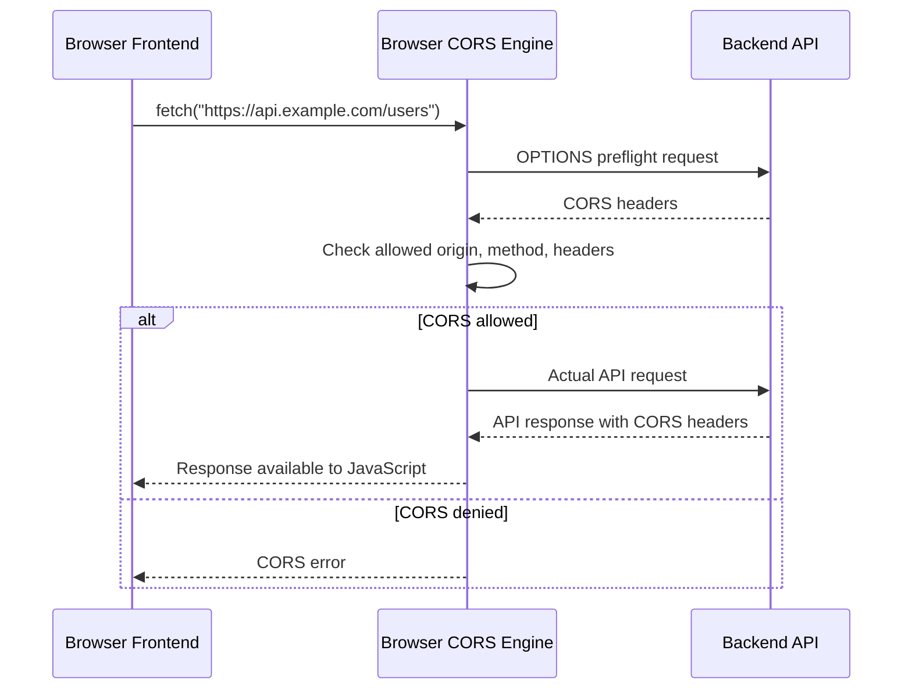
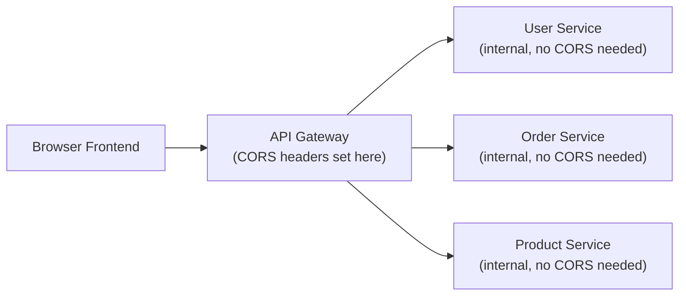

# CORS (Cross-Origin Resource Sharing)

## Overview

**CORS** stands for **Cross-Origin Resource Sharing**. It is a browser security mechanism that controls whether JavaScript running in one origin may access responses from another origin.

From a **backend developer perspective**, CORS is important because the backend decides, through HTTP response headers, which frontend origins are allowed to call an API from a browser.

Typical backend situations where CORS matters:

- a frontend SPA runs on `http://localhost:5173`
- a backend REST API runs on `http://localhost:8080`
- the browser blocks the frontend from reading API responses unless the backend allows that origin
- the backend must configure allowed origins, methods, headers, and credential behavior correctly

CORS is especially relevant for REST APIs used by browser-based clients such as React, Angular, Vue, or other Single Page Applications.

---

## Core Concept

### Definition

An **origin** is the combination of:

| Part | Example |
|---|---|
| Protocol / scheme | `https` |
| Host / domain | `example.com` |
| Port | `443` |

Two URLs have the **same origin** only if all three parts are identical.

Examples of different origins:

| URL A | URL B | Reason |
|---|---|---|
| `https://example.com` | `http://example.com` | different protocol |
| `https://example.com` | `https://api.example.com` | different host |
| `https://example.com:443` | `https://example.com:8080` | different port |

CORS allows a server to tell the browser:

> “This frontend origin is allowed to access this backend resource.”

The important point is that **CORS is enforced by browsers**, not by tools like Postman, curl, or backend-to-backend HTTP clients.

---

## Why CORS Exists

Browsers apply the **Same-Origin Policy** to protect users. Without this policy, a malicious website could use the user’s browser to read sensitive data from another site where the user is already logged in.

Example:

1. A user is logged into `https://bank.example`.
2. The user visits `https://evil.example`.
3. The malicious page tries to call `https://bank.example/api/account`.
4. The browser prevents the malicious JavaScript from reading the response unless the bank explicitly allows that origin through CORS headers.

CORS does **not** mean that the HTTP request is always prevented from reaching the server. In some cases, especially with simple requests, the browser may still send the request, but it blocks JavaScript from reading the response if the CORS policy does not allow it.

This distinction is important for backend developers.

---

## Same-Origin Policy vs. CORS

| Concept | Meaning |
|---|---|
| Same-Origin Policy | Browser rule that restricts cross-origin access by default |
| CORS | Controlled exception mechanism that allows selected cross-origin access |
| Backend responsibility | Send correct CORS response headers |
| Browser responsibility | Enforce the CORS decision |

CORS is therefore not an authentication system. It does not replace:

- authentication
- authorization
- CSRF protection
- input validation
- rate limiting
- API security controls

CORS only controls whether browser JavaScript may access cross-origin responses.

---

## How CORS Works

A browser checks CORS when frontend JavaScript sends a cross-origin request, for example using `fetch()` or `XMLHttpRequest`.

There are two main request types:

1. **Simple requests**
2. **Preflighted requests**

### Important CORS Headers

| Header | Sent by | Purpose |
|---|---|---|
| `Origin` | Browser | Tells the backend which origin made the request |
| `Access-Control-Allow-Origin` | Server | Defines which origin may access the response |
| `Access-Control-Allow-Methods` | Server | Defines allowed HTTP methods |
| `Access-Control-Allow-Headers` | Server | Defines allowed request headers |
| `Access-Control-Allow-Credentials` | Server | Allows cookies or credentials to be included |
| `Access-Control-Max-Age` | Server | Defines how long the browser may cache the preflight result |
| `Access-Control-Expose-Headers` | Server | Defines which response headers frontend JavaScript may read |

---

### Simple Requests

A **simple request** is a cross-origin request that meets specific browser-defined conditions.

Common examples:

- `GET`
- `HEAD`
- some `POST` requests with simple content types

For a simple request, the browser sends the actual request directly.

Example:

```http
GET /api/products HTTP/1.1
Host: api.example.com
Origin: https://frontend.example.com
```

The backend may respond with:

```http
HTTP/1.1 200 OK
Access-Control-Allow-Origin: https://frontend.example.com
Content-Type: application/json
```

If the `Access-Control-Allow-Origin` header matches the requesting origin, the browser allows the frontend JavaScript to read the response.

If the header is missing or does not match, the browser blocks access to the response.

---

### Preflight Requests

A **preflight request** is an automatic browser check sent before the real request.

The browser uses the HTTP `OPTIONS` method to ask the backend whether the actual request is allowed.

Preflight is commonly triggered when the request uses:

- methods such as `PUT`, `PATCH`, or `DELETE`
- custom headers such as `Authorization`
- non-simple content types such as `application/json`

Example preflight request:

```http
OPTIONS /api/users/42 HTTP/1.1
Host: api.example.com
Origin: https://frontend.example.com
Access-Control-Request-Method: DELETE
Access-Control-Request-Headers: Authorization
```

Example preflight response:

```http
HTTP/1.1 204 No Content
Access-Control-Allow-Origin: https://frontend.example.com
Access-Control-Allow-Methods: GET, POST, PUT, DELETE
Access-Control-Allow-Headers: Authorization, Content-Type
Access-Control-Max-Age: 3600
```

If the preflight response allows the requested method and headers, the browser sends the actual request.

```http
DELETE /api/users/42 HTTP/1.1
Host: api.example.com
Origin: https://frontend.example.com
Authorization: Bearer eyJ...
```

---

### CORS Request Flow



## Credentials and CORS

Credentials include:

- cookies
- HTTP authentication
- client certificates

When credentials are used, the frontend must explicitly enable them.

Example:

```javascript
fetch("https://api.example.com/profile", {
  credentials: "include"
});
```

The backend must also allow credentials:

```http
Access-Control-Allow-Origin: https://frontend.example.com
Access-Control-Allow-Credentials: true
```

Important rule:

```http
Access-Control-Allow-Origin: *
Access-Control-Allow-Credentials: true
```

This combination is not valid for credentialed browser requests.

When credentials are allowed, the backend must return a specific trusted origin, not `*`.

---

## Backend Developer Perspective

For backend developers, CORS configuration answers these questions:

| Question | Backend decision |
|---|---|
| Which frontend origins may access the API? | `Access-Control-Allow-Origin` |
| Which HTTP methods are allowed? | `Access-Control-Allow-Methods` |
| Which request headers are allowed? | `Access-Control-Allow-Headers` |
| Are cookies or credentials allowed? | `Access-Control-Allow-Credentials` |
| Should preflight responses be cached? | `Access-Control-Max-Age` |

A good backend CORS configuration should be:

- specific
- minimal
- environment-aware
- tested in a browser
- aligned with authentication and authorization

---

## Practical Example: Local Frontend and Backend

A common development setup:

| Component | URL |
|---|---|
| Frontend | `http://localhost:5173` |
| Backend API | `http://localhost:8080` |

Even though both run on `localhost`, the ports are different. Therefore, they are different origins.

The browser treats this as a cross-origin request:

```javascript
fetch("http://localhost:8080/api/products");
```

The backend must allow the frontend origin:

```http
Access-Control-Allow-Origin: http://localhost:5173
```

Without this header, the browser blocks the frontend from reading the API response.

---

## Example: Quarkus CORS Configuration

In Quarkus, CORS can be configured in `application.properties`.

```properties
quarkus.http.cors=true
quarkus.http.cors.origins=http://localhost:5173
quarkus.http.cors.methods=GET,POST,PUT,DELETE
quarkus.http.cors.headers=Content-Type,Authorization
quarkus.http.cors.exposed-headers=Location
quarkus.http.cors.access-control-allow-credentials=true
quarkus.http.cors.access-control-max-age=3600
```

This allows:

- requests from `http://localhost:5173`
- selected HTTP methods
- selected request headers
- credentialed requests if required
- caching of preflight responses for a limited time

For production, the allowed origin should usually be changed to the real frontend domain, for example:

```properties
quarkus.http.cors.origins=https://app.example.com
```

---

## Example: Spring Boot CORS Configuration

Spring Boot offers global CORS configuration through `WebMvcConfigurer`. The configuration mirrors Quarkus: define allowed origins, methods, headers, credentials, and cache duration. For details, refer to the Spring Framework documentation on [WebMvcConfigurer](https://docs.spring.io/spring-framework/reference/web/webmvc/mvc-cors.html) and `CorsRegistry`.

---

## Public APIs vs. Private APIs

CORS configuration depends on the API type.

| API type | Typical CORS strategy |
|---|---|
| Internal backend API | Allow only known internal frontend origins |
| Public read-only API | May allow many origins, sometimes `*` |
| Authenticated user API | Allow only trusted frontend origins |
| Admin API | Very restrictive CORS configuration |
| Third-party integration API | Specific partner origins if browser access is required |

A public API still needs proper authentication, authorization, rate limiting, and abuse protection. CORS alone does not secure an API from non-browser clients.

---

## CORS and Authentication

CORS and authentication solve different problems.

| Mechanism | Purpose |
|---|---|
| CORS | Controls browser access to cross-origin responses |
| Authentication | Verifies who the user or client is |
| Authorization | Decides what the user or client may do |
| CSRF protection | Protects against unwanted authenticated actions |
| JWT / session cookies | Carries identity or session information |

Example with bearer token:

```javascript
fetch("https://api.example.com/orders", {
  headers: {
    "Authorization": "Bearer eyJ..."
  }
});
```

Because `Authorization` is a non-simple header, the browser usually sends a preflight request first.

The backend must allow the `Authorization` header:

```http
Access-Control-Allow-Headers: Authorization, Content-Type
```

---

## CORS and CSRF

CORS is often confused with CSRF protection.

They are related to browser security, but they are not the same.

| Topic | CORS | CSRF |
|---|---|---|
| Main goal | Controls reading cross-origin responses | Prevents unwanted authenticated actions |
| Enforced by | Browser | Backend security design |
| Protects against | Unauthorized JavaScript access to responses | Malicious requests using existing user credentials |
| Backend still needed? | Yes | Yes |

Important:

> CORS does not automatically prevent CSRF.

For cookie-based authentication, the backend should still consider CSRF protection, SameSite cookie settings, and proper authorization checks.

---

## Testing CORS

CORS should be tested in a real browser because browsers enforce CORS.

Useful tools:

| Tool | Usefulness |
|---|---|
| Browser DevTools | Best tool for seeing CORS errors |
| Browser Network tab | Shows preflight and actual requests |
| curl | Useful for inspecting headers manually |
| Postman | Useful for API testing, but not reliable for reproducing browser CORS behavior |

Example manual preflight test with `curl`:

```bash
curl -i -X OPTIONS "http://localhost:8080/api/products" \
  -H "Origin: http://localhost:5173" \
  -H "Access-Control-Request-Method: GET"
```

Expected response headers:

```http
Access-Control-Allow-Origin: http://localhost:5173
Access-Control-Allow-Methods: GET,POST,PUT,DELETE
```

---

## CORS Troubleshooting Checklist

When CORS fails in the browser, use this diagnostic sequence:

1. **Check the preflight response**
   - Open Browser DevTools → Network tab
   - Look for an `OPTIONS` request before the actual request
   - Verify it returns 200 or 204 status (not 403, 404, or 500)

2. **Verify `Access-Control-Allow-Origin` matches exactly**
   - Check the response header against your frontend origin
   - Ensure protocol, host, and port are identical
   - Remember: `*` cannot be used with credentials

3. **Confirm the HTTP method is allowed**
   - Check if the method (`GET`, `POST`, `DELETE`, etc.) is in `Access-Control-Allow-Methods`
   - For preflight, the backend must allow the method for that path

4. **Verify required headers are allowed**
   - Check if `Authorization`, `Content-Type`, or other custom headers are in `Access-Control-Allow-Headers`
   - Remember: simple headers like `Accept` and `Content-Type` (for form data) are usually implicit

5. **Check credentials configuration**
   - If frontend uses `credentials: "include"`, backend must set `Access-Control-Allow-Credentials: true`
   - Also verify `Access-Control-Allow-Origin` is not `*` (must be specific origin)

6. **Ensure `OPTIONS` is not blocked**
   - Check security filters, API gateways, or reverse proxies
   - Confirm they handle `OPTIONS` requests and pass CORS headers through
   - Some firewalls or WAF rules may block `OPTIONS`

7. **Test in the browser, not Postman**
   - CORS is a browser rule only
   - If it works in Postman but not the browser, CORS configuration is the issue, not the API

---

## Common Browser Error

A typical CORS error looks like this:

```text
Access to fetch at 'http://localhost:8080/api/products'
from origin 'http://localhost:5173'
has been blocked by CORS policy.
```

This usually means one of the following:

- the backend did not include `Access-Control-Allow-Origin`
- the allowed origin does not match the frontend origin exactly
- the requested method is not allowed
- the requested header is not allowed
- credentials are used but not configured correctly
- the preflight `OPTIONS` request is not handled correctly

---

## Common Mistakes

### Mistake 1: Allowing All Origins in Production

```http
Access-Control-Allow-Origin: *
```

This may be acceptable for public, unauthenticated, read-only APIs, but it is usually unsafe for authenticated business APIs.

Better:

```http
Access-Control-Allow-Origin: https://app.example.com
```

---

### Mistake 2: Using `*` Together with Credentials

Invalid for credentialed browser requests:

```http
Access-Control-Allow-Origin: *
Access-Control-Allow-Credentials: true
```

Better:

```http
Access-Control-Allow-Origin: https://app.example.com
Access-Control-Allow-Credentials: true
```

---

### Mistake 3: Forgetting the `OPTIONS` Request

Preflight requests use `OPTIONS`.

If the backend, security filter, API gateway, or reverse proxy blocks `OPTIONS`, CORS may fail before the actual API request is sent.

Backend developers must ensure that preflight requests are handled correctly.

---

### Mistake 4: Testing Only with Postman

Postman does not enforce browser CORS rules in the same way as a browser.

An API can work in Postman but still fail in a frontend application.

Always test browser-based CORS behavior using the actual frontend or browser DevTools.

---

### Mistake 5: Treating CORS as API Security

CORS does not stop:

- curl requests
- Postman requests
- backend-to-backend requests
- malicious clients outside the browser
- unauthorized access if authentication is missing

A backend API must still enforce authentication and authorization.

---

## CORS in Microservices and API Gateways

In microservice architectures, CORS is often configured at the API gateway or edge service.

Example architecture:



Usually, the browser communicates only with the gateway. Therefore, CORS should often be handled at the gateway instead of configuring it separately in every microservice.

Benefits:

- centralized CORS rules
- consistent behavior
- fewer duplicated configurations
- easier production maintenance

However, backend services should still be protected internally. CORS at the gateway is not a replacement for internal security.

---

## CORS and WebSockets

CORS is mainly an HTTP browser mechanism.

WebSockets do not use CORS in the same way as normal HTTP requests. However, browsers usually send an `Origin` header during the WebSocket handshake.

Backend developers should validate the `Origin` header for WebSocket connections when necessary.

Example:

```text
Origin: https://app.example.com
```

For secure systems, do not assume that WebSocket connections are safe just because they come from a browser.

---

## CORS and Mobile Apps

Native mobile apps are not normally restricted by browser CORS rules.

CORS mainly affects browser-based JavaScript clients.

However, if a mobile app uses an embedded browser or WebView, CORS may still become relevant depending on how requests are made.

Backend developers should not rely on CORS to protect APIs from mobile clients. Authentication and authorization are still required.

---

## Best Practices for Backend Developers

| Practice | Reason |
|---|---|
| Allow only required origins | Reduces unnecessary exposure |
| Use exact origins in production | Avoids accidentally trusting unknown frontends |
| Avoid `*` for authenticated APIs | Prevents overly broad browser access |
| Allow only required methods | Limits attack surface |
| Allow only required headers | Prevents unnecessary request capabilities |
| Be careful with credentials | Credentials increase security risk |
| Cache preflight responses carefully | Improves performance |
| Test in a real browser | CORS is browser-enforced |
| Configure gateway/proxy consistently | Prevents environment-specific bugs |
| Keep CORS separate from authentication logic | Avoids false security assumptions |

---

## Key Concepts Summary

For FIAE exam preparation, CORS is relevant because it connects several backend and web development topics:

- HTTP methods
- HTTP headers
- REST APIs
- browser security
- frontend-backend separation
- authentication and authorization
- API configuration
- deployment environments
- debugging client-server communication

You should be able to explain:

1. what an origin is
2. why browsers enforce the Same-Origin Policy
3. what CORS allows
4. what a preflight request is
5. which headers are commonly used
6. why CORS is configured on the backend
7. why CORS is not a replacement for authentication
8. why Postman tests do not prove that CORS works in the browser


### 1. What is an origin?

An **origin** is made of three parts:

```text
protocol + host + port
```

Example:

```text
http://localhost:5173
```

| Part | Value |
|---|---|
| Protocol | `http` |
| Host | `localhost` |
| Port | `5173` |

Easy memory rule:

> **Origin = protocol + domain/host + port**

Two URLs are only the same origin if **all three parts are identical**.

---

### 2. Why do browsers enforce the Same-Origin Policy?

Browsers enforce the **Same-Origin Policy** to protect users from malicious websites.

Example:

1. You are logged into your bank website.
2. You open a malicious website in another tab.
3. The malicious website tries to read your bank data.
4. The browser blocks this because the two websites have different origins.

Easy memory rule:

> **Same-Origin Policy protects users from other websites reading their private data.**

---

### 3. What does CORS allow?

**CORS** allows a backend to say:

> “This frontend origin is allowed to access my API response.”

Example:

```text
Frontend: http://localhost:5173
Backend:  http://localhost:8080
```

These are different origins because the ports are different.

The backend can allow the frontend by sending:

```http
Access-Control-Allow-Origin: http://localhost:5173
```

Easy memory rule:

> **CORS is the backend giving browser permission for cross-origin access.**

---

### 4. What is a preflight request?

A **preflight request** is a browser check before the real request.

The browser sends an `OPTIONS` request to ask:

> “Backend, is this request allowed?”

Example:

```http
OPTIONS /api/users
Origin: http://localhost:5173
Access-Control-Request-Method: DELETE
```

If the backend allows it, the browser sends the real request.

Easy memory rule:

> **Preflight = browser asks permission before sending the real request.**

---

### 5. Which CORS headers are commonly used?

| Header | Easy meaning |
|---|---|
| `Origin` | The frontend origin making the request |
| `Access-Control-Allow-Origin` | Which frontend origin is allowed |
| `Access-Control-Allow-Methods` | Which HTTP methods are allowed |
| `Access-Control-Allow-Headers` | Which request headers are allowed |
| `Access-Control-Allow-Credentials` | Whether cookies/login credentials are allowed |
| `Access-Control-Max-Age` | How long the browser may remember the preflight result |

Easy memory rule:

> **Origin asks. Access-Control headers answer.**

---

### 6. Why is CORS configured on the backend?

CORS is configured on the backend because the backend owns the resource.

The backend must decide:

- which frontend may access the API
- which methods are allowed
- which headers are allowed
- whether credentials are allowed

The browser then checks the backend’s CORS headers and enforces the decision.

Easy memory rule:

> **Backend decides, browser enforces.**

---

### 7. Why is CORS not a replacement for authentication?

CORS only controls whether browser JavaScript may read a cross-origin response.

It does **not** prove who the user is.

It does **not** stop:

- Postman
- curl
- mobile apps
- backend-to-backend requests
- unauthorized users

Authentication answers:

> “Who are you?”

Authorization answers:

> “What are you allowed to do?”

CORS answers:

> “May this browser frontend read this cross-origin response?”

Easy memory rule:

> **CORS is not login. CORS is browser permission.**

---

### 8. Why do Postman tests not prove that CORS works in the browser?

Postman does not enforce CORS like a browser does.

An API can work perfectly in Postman but still fail in the browser because the browser checks CORS headers.

Example:

```text
Postman request: works
Browser fetch request: blocked by CORS
```

That happens because CORS is a **browser security rule**, not a general HTTP rule.

Easy memory rule:

> **Postman ignores CORS. Browsers enforce CORS.**

---

## Ultra-Short Memory Version

| Question | Memory Answer |
|---|---|
| What is an origin? | Protocol + host + port |
| Why Same-Origin Policy? | Protects user data from other websites |
| What does CORS allow? | Backend allows selected frontend origins |
| What is preflight? | Browser asks permission with `OPTIONS` |
| Common headers? | `Origin` asks, `Access-Control-*` answers |
| Why backend config? | Backend decides, browser enforces |
| Why not authentication? | CORS is not login |
| Why not Postman proof? | Postman ignores CORS, browsers enforce it |
---

## Short Example Answer for an Exam

CORS is a browser security mechanism that controls whether JavaScript from one origin may access resources from another origin. An origin consists of protocol, host, and port. If a frontend running on `http://localhost:5173` calls an API on `http://localhost:8080`, this is a cross-origin request. The backend must send CORS headers such as `Access-Control-Allow-Origin` to tell the browser that the frontend is allowed to access the response. For certain requests, the browser first sends an `OPTIONS` preflight request to check whether the actual method and headers are allowed. CORS does not replace authentication or authorization because it only controls browser access to responses.

---

## Summary

CORS is a controlled exception to the browser’s Same-Origin Policy. It allows a backend API to specify which frontend origins may access its responses from browser JavaScript.

For aspiring backend developers, the key lesson is:

> CORS is configured on the server, enforced by the browser, and should be treated as browser access control — not as complete API security.

A correct CORS setup is specific, minimal, tested in the browser, and aligned with the API’s authentication and authorization model.