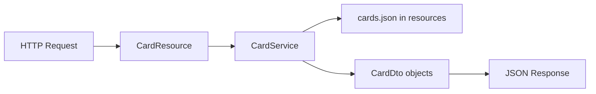
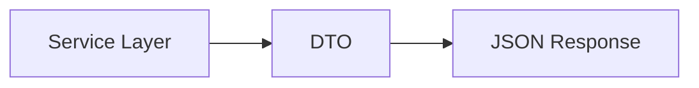

# Quarkus Backend — REST API Fundamentals

## Lesson Overview

This lesson documents the first core backend concepts learned while building a small REST API using **Quarkus**.

The focus is not only on making the application work, but on understanding the **structure and reasoning behind a typical Java backend**:

- exposing data through REST endpoints  
- separating responsibilities into resource, service, and DTO layers  
- loading data from JSON  
- designing the application so it can be extended later  

This lesson serves two purposes:

1. documenting a concrete implementation step-by-step  
2. establishing a foundational understanding for future backend topics  

---

## Learning Objective

The backend should:

- provide card data via HTTP endpoints  
- return JSON responses  
- use a simple layered structure  
- read data from `src/main/resources`  
- be extendable with filtering, validation, persistence, and additional endpoints  

---

## Core Architecture

### Target Structure

```text
src/main/java/com/seanconroy/fiae/
├── resource/
│   └── CardResource.java
├── service/
│   └── CardService.java
├── dto/
│   └── CardDto.java

src/main/resources/
└── seed/
    └── cards.json
```

---

## Architecture Flow



---

## Key Concept — DTO (Data Transfer Object)

### Definition

A **DTO (Data Transfer Object)** is a simple Java class used to transfer structured data between layers or between the backend and a client (e.g. frontend).

It represents the **shape of the data that is sent over the network**.

---

### Example

```java
public class CardDto {
    public String id;
    public String title;
}
```

---

### Why DTOs are used

Without DTO:

```java
return "[{\"id\":\"1\",\"title\":\"Test Card\"}]";
```

Problems:
- hardcoded JSON
- no type safety
- difficult to maintain
- no reuse

With DTO:

```java
CardDto card = new CardDto();
card.id = "1";
card.title = "Test Card";

return List.of(card);
```

Advantages:

- clear data structure  
- automatic JSON conversion  
- easier to extend  
- reusable across layers  

---

### Where DTOs fit in the architecture



The DTO sits between:

- **service layer** (internal logic)  
- **API response** (external representation)  

---

### Important clarification

A DTO is **not**:

- a database entity  
- a business logic class  
- responsible for processing data  

It is **only responsible for carrying data**.

---

### Learning insight

DTOs are one of the first steps from:

- “just returning data”  
→ to  
- “designing structured APIs”

---

## Development Progress and Explanation

## 1. Create the Quarkus Project

```bash
mvn io.quarkus.platform:quarkus-maven-plugin:create \
  -DprojectGroupId=com.seanconroy.fiae \
  -DprojectArtifactId=fiae-exam-part-1-backend
```

```bash
cd fiae-exam-part-1-backend
./mvnw quarkus:dev
```

---

## 2. Create a First Test Endpoint

```java
@Path("/hello")
public class GreetingResource {

    @GET
    @Produces(MediaType.TEXT_PLAIN)
    public String hello() {
        return "Backend is working";
    }
}
```

---

## 3. Create the First API Endpoint

```java
@Path("/api/cards")
```

```java
@GET
@Produces(MediaType.APPLICATION_JSON)
public String getCards() {
    return "[{\"id\":\"1\",\"title\":\"Test Card\"}]";
}
```

---

## 4. Introduce a DTO

```java
public class CardDto {
    public String id;
    public String title;
}
```

### Key idea

DTOs define the structure of API responses and replace manual JSON creation.

---

## 5. Return Real JSON from Objects

```java
public List<CardDto> getCards() {
    CardDto card = new CardDto();
    card.id = "1";
    card.title = "Test Card";

    return List.of(card);
}
```

---

## 6. Introduce a Service Layer

```java
@ApplicationScoped
public class CardService {
    public List<CardDto> getCards() {
        // logic
    }
}
```

```java
@Inject
CardService cardService;
```

---

## 7. Get by ID

```java
@GET
@Path("/{id}")
public CardDto getById(@PathParam("id") String id)
```

---

## 8. Organize Project Structure

```text
resource/
service/
dto/
```

---

## 9. Externalize Data (JSON)

```text
src/main/resources/seed/cards.json
```

---

## 10. Load JSON from Classpath

```java
getClass().getClassLoader().getResourceAsStream("seed/cards.json")
```

---

## 11. Expand DTO

```java
public class CardDto {
    public String id;
    public String title;
    public String description;
    public String module;
}
```

---

## 12. Add Filtering

```java
@GET
public List<CardDto> getCards(@QueryParam("module") String module)
```

---

## Key Concepts Learned

- REST endpoints  
- DTO pattern  
- service layer  
- dependency injection  
- JSON mapping  
- classpath resources  
- query vs path parameters  

---

## Core Insight

Backend development progresses from:

simple endpoint → structured API → layered architecture → extensible system
